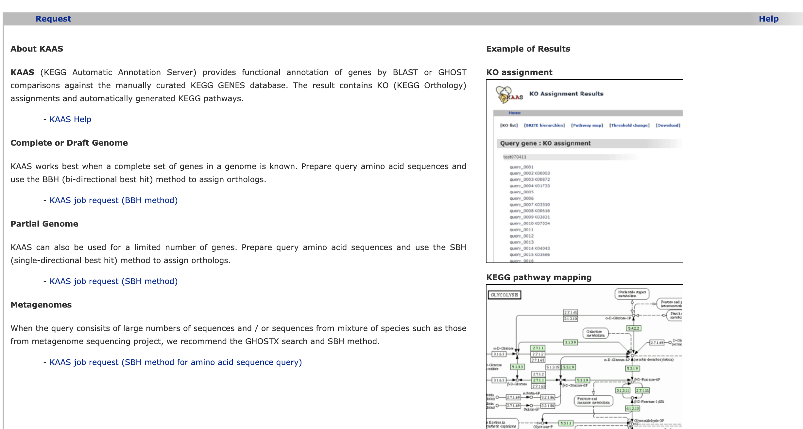
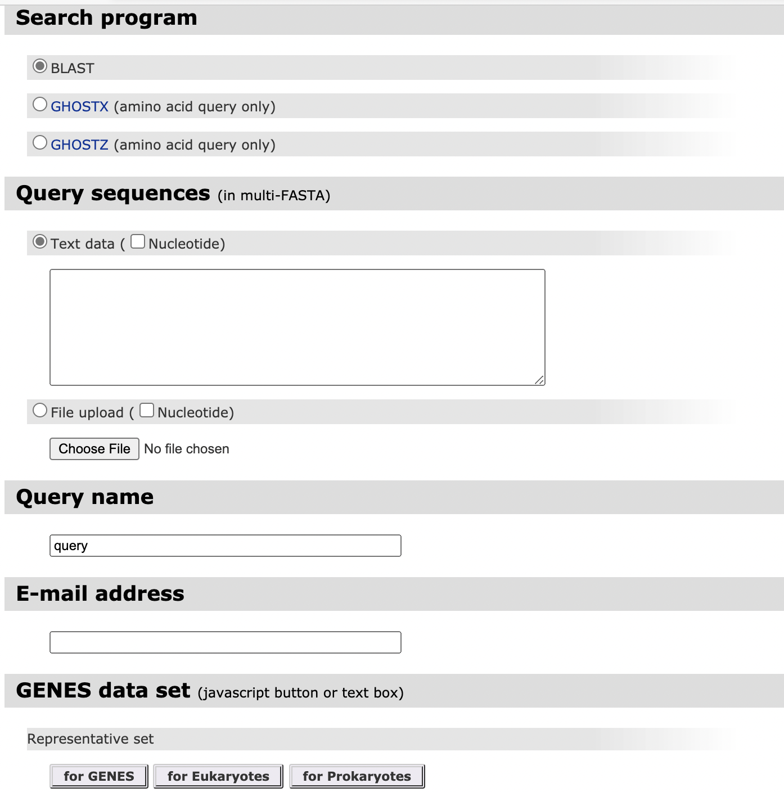
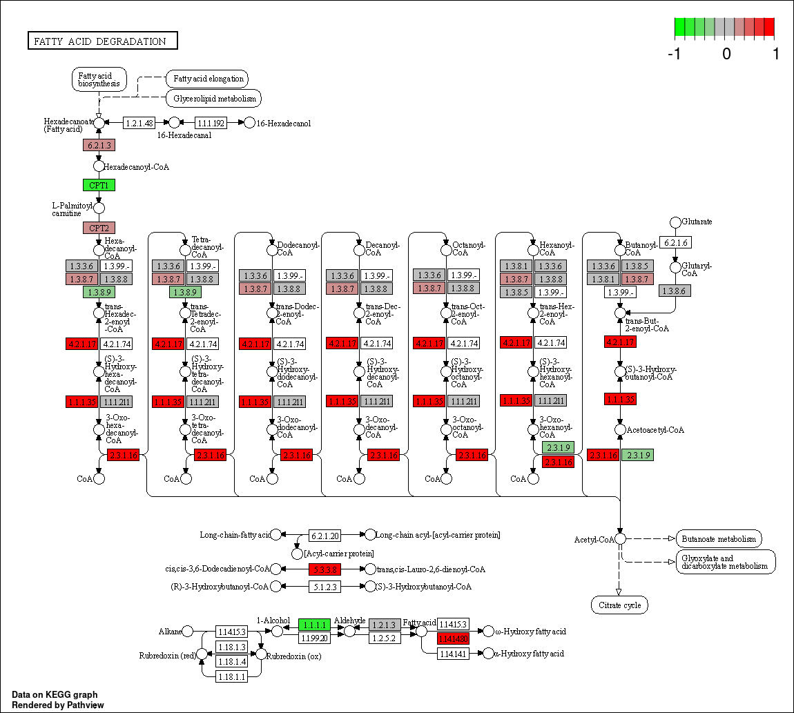

# 非模式物种KEGG注释及富集分析

针对非模式物种，通常采用序列比对的方法根据同源序列获得KEGG的注释。尽管有一些网站如EggNOG([EggNOG Database | Orthology predictions and functional annnotaion (embl.de)](http://eggnog5.embl.de/))可以在线进行KEGG注释和，但是最权威的还是KEGG的官方注释平台[KAAS - KEGG Automatic Annotation Server (genome.jp)](https://www.genome.jp/tools/kaas/)

## 1.KAAS 注释基因序列

KEGG自动注释服务支持fasta格式的蛋白或者基因序列来注释，包括3种模式：

- 基因组草图模式（BBH）
- 部分基因组模式（SBH）
- 宏基因组模式

对于非模式物种，更适合SBH模式以便获得更多的注释。



注释时候用BLAST比较准确，用GHOSTZ速度比较快，针对已知物种，建议用原核或真核的代表基因加上对应物种的编号来进行注释



## 2.整理注释文件

注释结果是纯文本文件，分为两列，第一列是基因ID，第二列是KEGG的KO编号，基因ID会自动对fasta格式进行简化，后期分析要注意。

|x1|x2|
| ------ | ------ |
| ENSGALG00000054818 | K00088 |
| ENSGALG00000053455 |        |
| ENSGALG00000045540 | K10072 |


针对一个基因有多个KO注释的情况，可以用R语言进行长宽数据的转化

```{r}
library(dplyr)
tmp %>% group_by(X1) %>%  do(data.frame(X2=paste(.$X1,collapse=",")))
```


## 3.KEGG富集分析

感谢CJ写的TBtools[CJ-Chen/TBtools: GUI/CommandLine Tool Box for biologistists to utilize NGS data. (github.com)](https://github.com/CJ-Chen/TBtools)，可以实现图形界面或者命令行下的一健KEGG注释

```{bash}
ls
TBtools.jar
TBtools.KeggBackEnd
kegg_annotation.txt
test.fasta.id.txt
kegg.sh
```

```{bash}
bash kegg.sh -h
Usage: kegg.sh <options> -r TBtools.KeggBackEnd -b kegg_annotation -i sel_gene -o outfile
  ### INPUT: TBtools.KeggBackEnd(from Kegg or TBtools) kegg_annotation(gene KO) sel_gene ###
  ### OUTPUT: kegg.results.txt ###

  Options:

    -r TBtools.KeggBackEnd.ref.txt
    -b kegg_annotation
    -i sel_gene
    -o result
  NOTE:
    1) ### kegg_annotation sep = \t ###
  bash kegg -r TBtools.KeggBackEnd -b kegg_annotation -i test.fasta.id.txt -o test.out.txt
```

其中，TBtools.KeggBackEnd是KEGG的背景注释文件，从CJ处获得，kegg_annoation是KAAS的注释结果，test.fasta.id.txt是需要富集的基因ID，名称需要和kegg_annoation中的完全对应，test.out.txt是输出文件。

可视化分析可以用[联川生物云平台 (omicstudio.cn)](https://www.omicstudio.cn/index)

```{bash}
#!/bin/bash
help(){
        cat <<-EOF
  Usage: kegg.sh <options> -r TBtools.KeggBackEnd -b kegg_annotation -i sel_gene -o outfile 
  ### INPUT: TBtools.KeggBackEnd(from Kegg or TBtools) kegg_annotation(gene KO) sel_gene ###
  ### OUTPUT: kegg.results.txt ###
 
  Options:
    
    -r TBtools.KeggBackEnd.ref.txt 
    -b kegg_annotation
    -i sel_gene
    -o result
  NOTE:
    1) ### kegg_annotation sep = \t ###

EOF
        exit 0
}
if [ $# -lt 1 ];then # $# -lt 1表示参数少于1个
        help
        exit 1
fi

while getopts ":r:b:i:o:h" opt
do
    case $opt in
        r)
        kegg=$OPTARG
        ;;
        b)
        background=$OPTARG
        ;;
        i)
        input=$OPTARG
        ;;
        o)
        out=$OPTARG
	;;
	h) help
	;;
	?) help
            exit 1;;
    esac
done
java -cp TBtools.jar biocjava.bioDoer.Kegg.AdvancedForEnrichment.KeggEnrichment --inKegRef $kegg  --Kannotation $background --selectedSet $input --outFile $out

```

## 4.KEGG通路的可视化

针对差异基因，可以用KEGG的官方网站进行可视化[KEGG Mapper Color](https://www.kegg.jp/kegg/mapper/color.html)

也可以用R包pathview（[Pathview (uncc.edu)](https://pathview.uncc.edu/)）进行批量的可视化

Pathview是一个用于整合表达谱数据并用于可视化KEGG通路的一个R包，其会先下载KEGG官网上的通路图，然后整合输入数据对通路图进行再次渲染，从而对KEGG通路图进行一定程度上的个性化处理，并且丰富其信息展示。

在`KEGG`中有两种代谢图。

- 参考代谢通路图 `reference pathway`，是根据已有的知识绘制的具有一般参考意义的代谢图；这种图上所有小框都是无色的，不会有绿色的小框，并且都可以点击查看更详细的信息；

- 特定物种的代谢图 `species-specific pathway`，会用绿色来标出这个物种所有的基因或酶，只有这些绿色的框点击以后才会给出更详细的信息。

针对差异基因的数据，可以直接用基因的NCBI编号画图

pathway id从之前的KEGG富集分析中获得，out.suffix 可以填该通路的名称

```{r}
library(pathview)
pathview(gene.data = diffgene$ENTREZID, pathway.id = "04723", species = "mmu",
              out.suffix = "test", kegg.native = T)
```

针对基因的表达量，或者foldchange,pvalue等数值型数据，需要把基因整理成"numeric"类型，其中name的值为基因的NCBI编号（ENTREZID）

```{r}
pathview(gene.data = a, pathway.id = "00071", species = "mmu",
+          out.suffix = "test", kegg.native = T)
```



## 5. 在线工具

- KOBAS[http://kobas.cbi.pku.edu.cn/]
  北京大学生物信息学中心开发,2021年更新后支持很多物种

- Eggnog[[eggNOG-mapper (embl.de)](http://eggnog-mapper.embl.de/)]

  